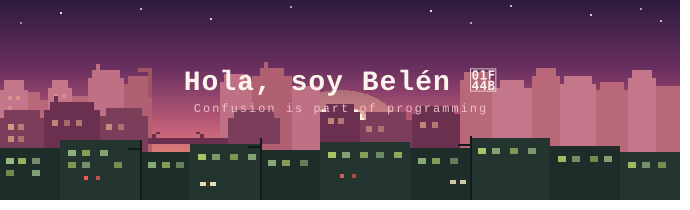

<!-- HEADER -->

  

---

## 🌆 Sobre mí

Soy **Técnica Superior en Desarrollo de Software** con fuerte experiencia en frontend y backend. Me apasiona construir aplicaciones completamente a medida, pensar en arquitectura y seguir aprendiendo en cada proyecto.

Además fundé **Sushi Software Studio** — un estudio de desarrollo donde transformo ideas en soluciones digitales reales, con atención personalizada desde el primer mensaje.

- 🏗️ Construyo con **React, Node.js, Express, Python y PHP**
- ☁️ Despliego en **Railway, Vercel** y gestiono **dominios personalizados**
- 🗄️ Trabajo con **PostgreSQL, MySQL y MongoDB**
- 🧑‍🏫 Profe de **Python** para jóvenes (10–17 años)
- 🍣 Fundadora de **[Sushi Software Studio](https://sushisoftwarestudio.com.ar/)**
- 💬 Preguntame sobre **arquitectura de apps, APIs REST, deploy y bases de datos**
- 📫 **Email:** belenhumbert69@gmail.com
- 💼 **LinkedIn:** [Belén Humbert](https://www.linkedin.com/in/bel%C3%A9n-humbert/)

---

## 📊 Estadísticas

  
  &nbsp;
  

  

---

## 🧠 Stack tecnológico

### 🎨 Frontend

  

### ⚙️ Backend

  

### 🗄️ Bases de datos

  

### ☁️ Deploy & Cloud

  

### 🛠️ Herramientas

  

---

## 🍣 Sushi Software Studio

  

  

**Desarrollo completamente a medida — sin templates, con atención personalizada.**

 

&nbsp;&nbsp;

## 🤝 Conectemos

  
  &nbsp;
  
  &nbsp;
  

---

*✨ Siempre aprendiendo, siempre construyendo ✨*

